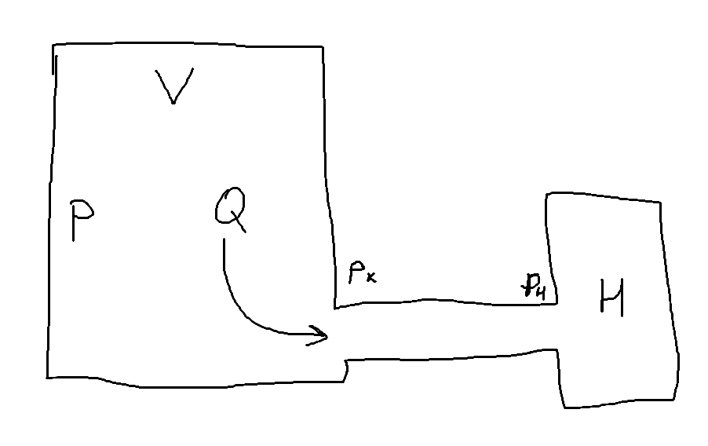
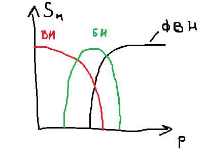
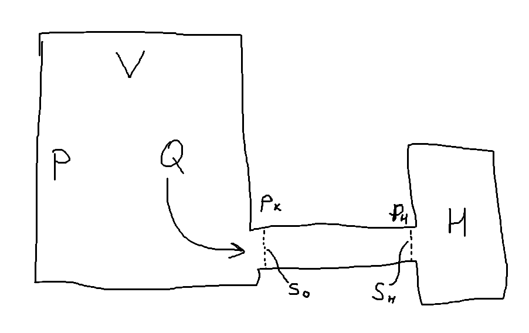
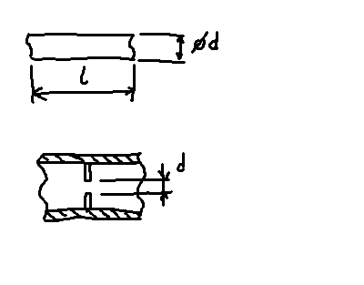
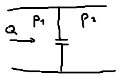

##### Единицы давления:
Па, 1 мм рт. ст. = 1 торр = 133 Па, бар = $10^5$ Па, мбар = 100 Па

##### Вакуум классифицируется течением газа
Число Кнудсена
$$Кн=\dfrac{\lambda}{d}$$
$Кн<0,01$ вязкостное течение (молекулы почти не бьются об стенку)
$1/3>Кн>0,01$ переходный режим
$Кн>{1}/{3}$ молекулы бьются об стенку чаще, чем об другие молекулы (молекулярное течение)

$pd>0,7\ Па\cdot м$ вязкостное течение (форвакуум)
$0,02<pd<0,7\ Па\cdot м$ переходное течение (средний)
$pd<0,02\ Па\cdot м$ молекулярное течение (высокий, он же глубокий)

Насосы, работающие при средних вакуумах, называются бустерными.

Сверхвысокий вакуум - такое давление, при котором на образец не сконденсируется полный атомарный слой за время техпроцесса.
Пусть время будет 1 час$$N=\dfrac{1}{4}nV=2,84\cdot 10^{22}\cdot p\ \dfrac{1}{м^2\cdot с}$$ $$\sigma=3,6\cdot 10^{-10} м$$ $$N=7,72\cdot 10^{18} \dfrac{1}{м^2}$$ $$p=7,5\cdot 10^{-8}\ Па=5,7\cdot 10^{-10}\ торр$$
На самом деле этот порог выше (около $10^{-6}$ Па).

***Газовый поток***
$pV=\dfrac{m}{M}RT \Rightarrow m=pV\dfrac{M}{RT}$
$pV$ - "количество газа"

$Q=\dfrac{dpV}{dt}\ \left[\dfrac{Па\cdot м^2}{с}\right],\ \left[SCCM\right] = 1,69\cdot 10^{-3}\ \left[\dfrac{Па\cdot м^2}{с}\right]$ - газовый поток (SCCM - standard cubic centimeter per minute)

$Q_m=\dfrac{dm}{dt}=Q\dfrac{M}{RT}=Q\dfrac{A}{kT}$ - массовый поток ($A$ - масса молекулы)

$N=\dfrac{Q}{kT}$, $Q_I=\dfrac{Q}{kT}\cdot e$ - расход в токовых единицах

$Q=\dfrac{dpV}{dt}=p\dfrac{dV}{dt}+V\dfrac{dp}{dt}\approx p\dfrac{dV}{dt}$ (считаем, что режим установившийся)

$S=\dfrac{dV}{dt}$ - скорость откачки

$Q=pS$

$U=\dfrac{Q}{p_к-p_н}$ - проводимость трубопровода

**Характеристика насоса**

Высоковакуумный насос при большом давлении не выживет, а форвакуумный при низком - выживет.

**Эффективная скорость откачки**

$S_0$ - эффективная скорость откачки,
$S_н$ - характеристика насоса (скорость откачки насоса $\dfrac{м^3}{с}$)

#### Основное уравнение вакуумной техники
$$Q_к=Q_{тр}=Q_н$$
$$Q_к=p_кS_0$$
$$Q_{тр}=U(p_к-p_н)$$
$$Q_н=p_нS_н$$
$$\dfrac{1}{U}=\dfrac{1}{S_0}-\dfrac{1}{S_н}$$
$$\dfrac{1}{S_0}=\dfrac{1}{U}+\dfrac{1}{S_н}\ (1)$$
$S_н \gg U \Rightarrow S_0=U$
$S_н \ll U \Rightarrow S_0=S_н$

##### Расчет трубопровода

1. Круглая труба
	1. Длинная $l\gg d$ (в 10 раз)
2. Диафрагма
	1. Малая $d\ll d_Т$ (в 10 раз)

Диафрагма вязкостного режима течения:

для малой диафрагмы:
	$\tau = \dfrac{p_2}{p_1}$
	$\tau<0,1$: $U=200F$
	$0,1<\tau<0,528$: $U=200\dfrac{F}{1-\tau}$
	$\tau>0,528$: $U=766\cdot \tau^{0,714}\dfrac{F}{1-\tau}\sqrt{1-\tau^{0,280}}$
для большой диафрагмы:
	$U_Б=U_м\dfrac{F_т}{F_т-F}$
