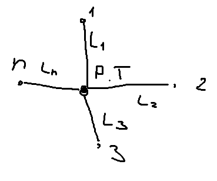
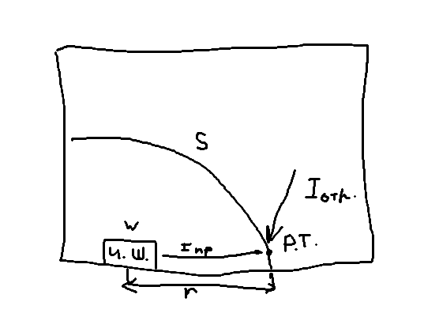

Суммарный уровень шума: $L_\Sigma=10lg\sum^n_{i=1}10^{0,1L_i}$

Если есть несколько (n) одинаковых уровней шума (в расчетную точку попадает одинаковый уровень шума):
$L_\Sigma=L+10lg\left(n\right)$

>Пример: 2 источника, 60 дБ. Найти суммарный уровень:
>$L_\Sigma=60+10lg(2)=63\ дБ$

$L_\Sigma=L_{max}+N$

| $L_1-L_2$  | 0   | 1   | 2   | 4   | 6   | 9   |
| ---------- | --- | --- | --- | --- | --- | --- |
| $\Delta L$ | 3   | 2,5 | 2   | 1,5 | 1   | 0,5 |

| $f_a,\ Гц$ | $L,\ дБ$ | $L_A$ | $L+L_A$ |
| ---------- | -------- | ----- | ------- |
| 125        | 96       | -16,1 | 79,9    |
| 250        | 80       | -8,6  | 71,4    |
| 500        | 78       | -3,2  | 74,8    |
| 1000       | 80       | 0     | 80,0    |
| 2000       | 78       | 1,2   | 79,2    |
| 4000       | 90       | 1,0   | 91,0    |
$L_\Sigma=10lg\sum{10^{0,1(L_i+L_{A_i})}}=10lg(10^{79,9}+...+10^{91,0})\approx92\ дБА$

#### Разбор ДЗ

$I_{рт}=I_{пр}+I_{отр}=\dfrac{W\cdot Φ}{S}+\dfrac{4W}{B}$

$L=L_W+10lg\left(\dfrac{Φ}{S}+\dfrac{4}{B}\right)$

$\Phi=\dfrac{I_i}{I_{ср}}$ - фактор направленности (для ненаправленных источников 1)
$S=\Omega\cdot r^2$ - площадь (в телесном угле надо учитывать пол, потолок)
$B$ - постоянная помещения. Варианты расчета:
1. Сложная формула
2. Таблица
$L_{A\ норм}=80\ дБА$
СанПиН 1.2.3685-21
Свод правил 51 13330.2011 Защита от шума (ПС-75 (1000 Гц - норма 75 дБ))

Будут проверять площади, B, частотные множители. Короче письменно, от руки и все расписывать

>Пример задачи

$f=1000\ Гц$
$L_W=80\ дБ$
$r=2\ м$
$I_{пр}=I_{отр}$
$\Omega=4\pi$
$\Phi=1$
$ПС-75$

$L=L_W+10lg\left(\dfrac{\Phi}{S}+\dfrac{4}{B}\right)=L_W+10lg\left(2\dfrac{\Phi}{S}\right)=L_W+10lg\left(2\dfrac{1}{\Omega r^2}\right)=66\ дБ$

